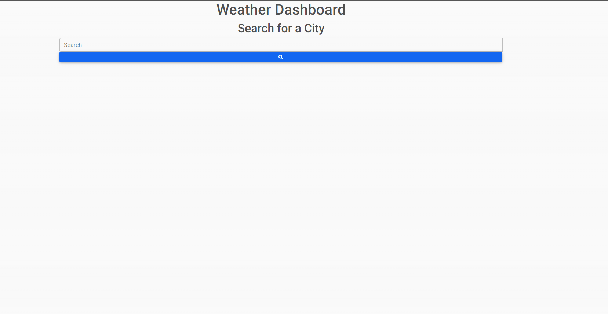
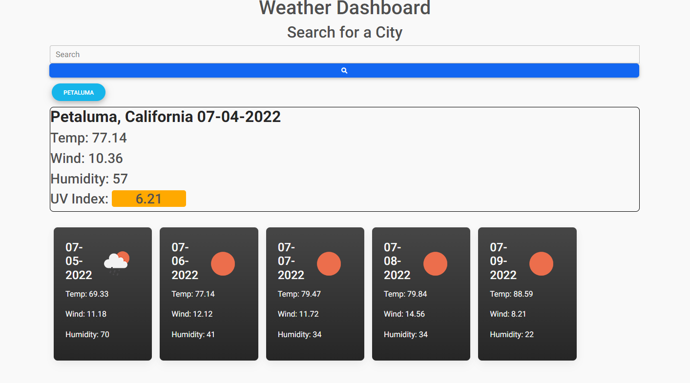

# Weather Dash
​​
## Table of Contents

- [Overview](#overview)
  - [The challenge](#the-challenge)
  - [User Story](#user-story)
  - [Acceptance Criteria](#acceptance-criteria)
  - [Screenshot](#screenshots)
  - [Links](#links)
- [My process](#my-process)
  - [Built with](#built-with)
  - [What I learned](#what-we-learned)
  - [Continued development](#continued-development)
  - [Useful resources](#useful-resources)
- [Author](#author)
- [Acknowledgments](#acknowledgments)

## Overview

### The Challenge

This was a challenge to create a dynamic Weather Dashboard for a user to search for cities and get the current weather plus a 5 day forecast.

### The User Story

```
AS A traveler
I WANT to see the weather outlook for multiple cities
SO THAT I can plan a trip accordingly
```

### Acceptance Criteria

```
GIVEN a weather dashboard with form inputs
WHEN I search for a city
THEN I am presented with current and future conditions for that city and that city is added to the search history
WHEN I view current weather conditions for that city
THEN I am presented with the city name, the date, an icon representation of weather conditions, the temperature, the humidity, the wind speed, and the UV index
WHEN I view the UV index
THEN I am presented with a color that indicates whether the conditions are favorable, moderate, or severe
WHEN I view future weather conditions for that city
THEN I am presented with a 5-day forecast that displays the date, an icon representation of weather conditions, the temperature, the wind speed, and the humidity
WHEN I click on a city in the search history
THEN I am again presented with current and future conditions for that city
Mock-Up
```

### Screenshots

#### Example of page upon arrival

This is how the page looks upon first arrival without any previous searches

#### Example of a search result

How the page populates with a search results data

### Links

- Live Site URL: [weatherDash](https://jmonty94.github.io/weatherDash/)

## My Process

### Built with

- jQuery and Vanilla JS due to some complications from MDBootstrap and jquery

### What I Learned

Due to MDBootstrap also using jquery there are some issues when creating elements for cards using jquery when MDBootstrap is installed

### Continued Development

Would like to go over and reformat

### Useful resources

- [MDBootstrap](https://mdbootstrap.com/) - CSS library
- [w3Schools](https://www.w3schools.com/) - Resource with great examples and navigation between different functionality
- [MDN Web Docs](https://developer.mozilla.org/en-US/docs/Learn/JavaScript) - In-depth documentation for elements or functions
- [stackoverflow](https://stackoverflow.com/) - Answered specific questions from various collaborators
- [jQuery](https://api.jquery.com/) - resource for all of the available jQuery library

## Author

[James Montgomery](https://jmonty94.github.io/portfolio/)
